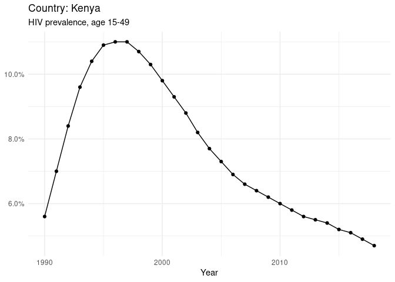
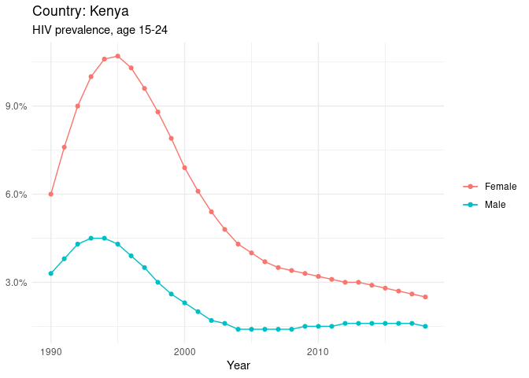
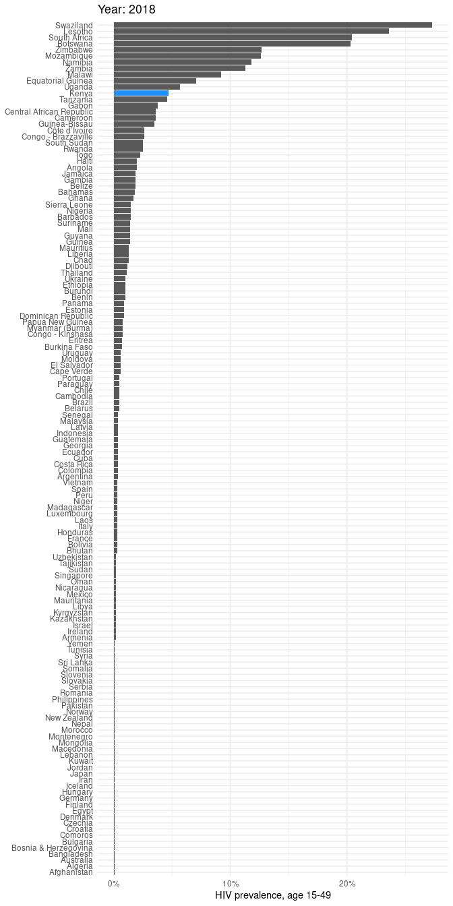

Country Profile
================
Maria Benavides
2020-05-09

# Data

The file `hiv_rates.csv` contains a tidy dataset with six columns:

1.  The ISO3 code of the country that reported data.
2.  The year for which data was reported.
3.  The percentage of HIV-positive individuals age 15-49.
4.  The percentage of HIV-positive females age 15-24.
5.  The percentage of HIV-positive males age 15-24.

# Country Report: Kenya

For which years do we have data for Kenya?

    ## # A tibble: 29 x 1
    ##     year
    ##    <dbl>
    ##  1  1990
    ##  2  1991
    ##  3  1992
    ##  4  1993
    ##  5  1994
    ##  6  1995
    ##  7  1996
    ##  8  1997
    ##  9  1998
    ## 10  1999
    ## # … with 19 more rows

How has HIV incidence changed over time in
Kenya?

<!-- --><!-- -->

How does Kenya compare in 2018?

<!-- -->
